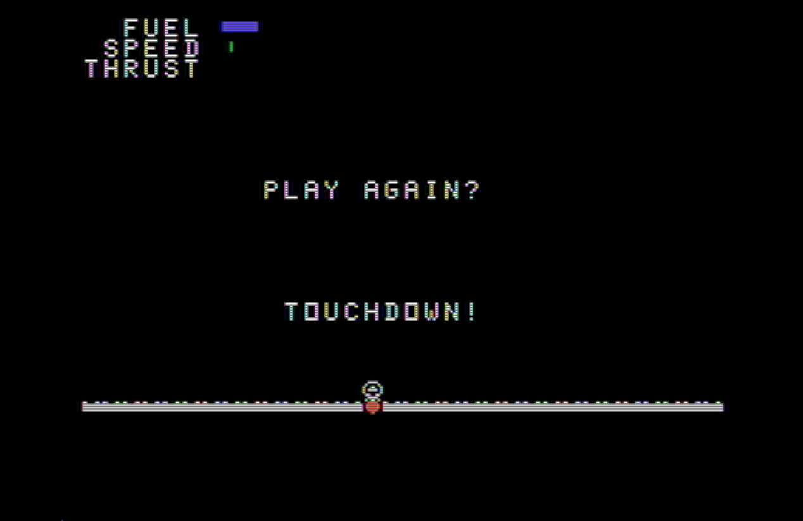

# SpaceLander-TI
TI-99/4A port of C64 Space Lander from COMPUTE'S! GAZETTE magazine Issue 5

| **Space Lander -- Version 00 - Port from C64 to TI-99/4A** |
| ------- |
|  | 

---

Space Lander is originally a C64 program by Chris Garret and published by COMPUTE!'s Gazette magazine in Issue 5, November 2025.

This is a port to the TI-99/4A.  The program is written and tested in the Classic99 emulator for the TI99/4A V2.2 system.

There were challenges.

As far as I can tell, TI Extended Basic does not provide a way to print a text string at a specific location on the screen. I could not figure it out. Correct me if I'm wrong.

To deal with printing text messages and the game statistics, I made a subroutine to walk through the characters of a string and display them on screen with HCHAR, character by character. This HCHAR plan works, but it is slow. Very Slow. Slow as in when the game was updating the statistics with the Lander it was a slide show running at one frame every few seconds. It needed optimizations. Or magic.

First, the program was printing the labels for Fuel, Speed, and Thrust with every update to the screen. This was changed to present the labels on the screen once at the program start, and then only print the Fuel, Speed, and Thrust numbers. This cut down the screen updates enough to speed up the game to a little more than 1 frame a second. Still, the problem was that to print the statistics numbers character by character it could still require a dozen separate updates to the screen.

The screen updates needed to be reduced to as few characters as possible per stat. I came up with the idea to map a graphics character to indicate degrees of values. Speed is indicated by arrows that point up and down depending on direction. Thrust is represented by a growing arrow indicating degree of thrust. The Fuel is represented by a bar chart where pixels represent each unit of fuel.

Fuel was easy to map to a list of characters as it is a simple integer. Thrust and Speed are floating point numbers, so I had to come up with formulas that scale up the scope of the values into a range of integers, 1, 2, 3... What I have works. More or less. It could definitely be better.

But, in the end the game runs at a couple frames per second which is fast enough to qualify as game-like.

Also, since redefined characters were now in play for the statistics values, then the ground, the lander and the thrust flames were added as redefined characters.

One of the other additions is that since the TI Extended BASIC supports longer, meaningful variable names, the variables have been updated for better readability.

---

The files:

* TI_LANDER_XB -- TI Extended Basic Program saved by the emulator on the host's emulated disk.
  
* TI_LANDER.txt -- PC Text file version of the BASIC listing. Copy from Notepad++ and paste into the Classic99 window works fine.

---
